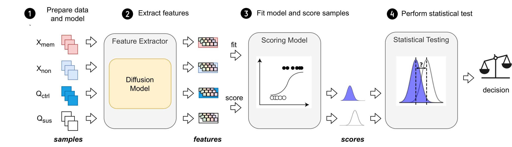

# CDI: Copyrighted Data Identification in Diffusion Models

### Keywords
 
dataset inference, diffusion models, copyright, intellectual property, membership inference

### TL;DR

We demonstrate that existing membership inference attacks are not effective in confidently identifying (illicit) use of data to train diffusion models and instead propose the first dataset inference-based method to achieve this goal.



## Abstract

Diffusion Models (DMs) benefit from large and diverse datasets for their training. Since this data is often scraped from the internet without permission from the data owners, this raises concerns about copyright and intellectual property protections. While (illicit) use of data is easily detected for training samples perfectly re-created by a DM at inference time, it is much harder for data owners to verify if their data was used for training when the outputs from the suspect DM are not close replicas. Conceptually, membership inference attacks (MIAs), which detect if a given data point was used during training, present themselves as a suitable tool to address this challenge. However, we show that existing MIAs are not practical due to their low confidence on individual data points’ membership status. To overcome this limitation, we propose Copyrighted Data Identification (CDI), a framework for data owners to confidently verify whether their data was used to train a given DM. CDI relies on dataset inference techniques, i.e., instead of using the membership signal from a single data point, CDI leverages the fact that most data owners, such as website providers, bloggers, artists, or publishers own datasets with multiple publicly exposed data points which might all be included in the training of a given DM. By using the signal from existing MIAs and new handcrafted methods to extract features from these datasets, feeding them to a scoring model, and applying rigorous statistical testing, CDI allows data owners with as little as 30 data points to identify with a confidence of more than 99% whether their data was used to train a DM. Thereby, CDI represents a valuable tool for data owners to claim illegitimate use of their copyrighted data. 

## Third-party resources

In our work we use the following third-party resources, with their corresponding licenses (in parenthesis):
* DiT (CC-BY-NC)
* U-ViT (MIT License)
* LDM (MIT License)
* MS COCO (CC-BY-4.0)

## Codebase setup

### Environment configuration

A suitable conda environment named `cdi` can be created and activated with:

```
conda env create -f environment.yaml
conda activate cdi
```

#### Troubleshooting

In case of GBLICXX import error run `export LD_LIBRARY_PATH=$LD_LIBRARY_PATH:[YOUR_PATH_TO_CONDA]/envs/cdi/lib` (based on [this](https://stackoverflow.com/a/71167158))

### Downloading models

```
gdown https://drive.google.com/drive/folders/143b1wF1iWEU2DASTk-sfTRwW7KiEC3IX?usp=sharing --folder
```

### Downloading data and data preparation

* ImageNet: Download [train](https://academictorrents.com/details/a306397ccf9c2ead27155983c254227c0fd938e2) and [validation](https://academictorrents.com/details/5d6d0df7ed81efd49ca99ea4737e0ae5e3a5f2e5) ImageNet LSVRC 2012 splits.

* MS-COCO: Download COCO 2014 [training](http://images.cocodataset.org/zips/train2014.zip), [validation](http://images.cocodataset.org/zips/val2014.zip) data and [annotations](http://images.cocodataset.org/annotations/annotations_trainval2014.zip). Then extract annotations features according to `helper_scripts/uvit_extract_embeddings.py`. 

## General structure

The following is the summary of the structure of this codebase, as well as short manual on how to use & build ontop of it.

### conf

This directory contains configuration files for: actions, attacks, models, submodules, and a main `config.yaml` file with general settings regarding output directories, and experiments size.

### experiments

Source code to obtain results for all experiments.

### helper_scripts/uvit_extract_embeddings.py

Script necessary to extract text embeddings of the COCO dataset for U-ViT text-conditioned models.

### src/attacks

This directory contains source code for all features we extract, and all attacks we perform in our paper. The process is split in two parts: features extraction, and scores computation. By splitting this in two parts we achieve flexibility on the further usage of extracted features, and recommend to follow the same approach when extending the codebase with novel features extraction methods.

### src/dataloaders

Code necessary to load data for experiments, as the configuration differs between different diffusers and datasets.

### src/evaluation

Utility code used to evaluate MIAs as well as CDI on various benchmarks. We support TPR@FPR=p% (where p is param), accuracy, p-value (for CDI), and AUC.

### src/models

Module providing wrappers on existing SOTA diffusion models, exposing necessary interfaces for our methods, in order to make them agnostic from each other.

### main.py

Main entry script to perform all experiments. We support four actions: features_extraction, scores_computation, evaluation, evaluation_bulk. You can run it the following way: `python3 -u main.py +action=[ACTION] +model=[MODEL] +attack=[ATTACK]`.

## Experiments overview

Our experiments start by extracting all features for all attacks for all models in the paper. The results are fully reproducible, and you can obtain the features by running the following bash script.

```
for MODEL in ldm uvit dit uvit_512 dit_512 uvit_uncond uvit_t2i uvit_t2i_deep;
do
    for ATTACK in denoising_loss secmi_stat pia pian gradient_masking noise_optim multiple_loss cdi;
    do
        python3 -u main.py +action=features_extraction +model=$MODEL +attack=$ATTACK;
    done
done
```

Next, we're good to go to run scripts that evaluate CDI from various of perspectives.

### MIA

`experiments\mia.py` provides results regarding performance of MIA in our setting for all models. Table 1, 5, 6, and 7, as well as Figure 6 is the output of the script.

### CDI Results

`experiments\cdi_perf.py` provides results for Figure 2 in the paper, on the efficacy of CDI in regard to Q_sus size.

### Features Ablation

`experiments\features_ablation.py` computes data necessary for the features ablation study on the performance of CDI. It stores the data necessary for the left heatmap in the Figure 3. To obtain it, run `experiments\trainset_size_ablation.py`, and only then `experiments\ablation_heatmap.py`. The data from this script are also used for Table 2, to highlight the potential of CDI under Black-Box Model Access setting.

### Trainset Size Ablation

`experiments\trainset_size_ablation.py` computes data necessary for the study on the impact of the size of X_mem on the performance of CDI. It stores the data necessary for the right heatmap in the Figure 3.

### Contamination Ratio Ablation & False Positives

`experiments\contamination_ablation.py` performs an experiment on the contamination ratio impact on the effectiveness of CDI. The Figure 4 utilizes the data output from this script. For analysis of false positives in Table 3 we use data for contamination ratio = 1.